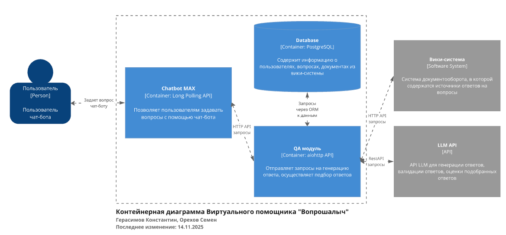

# Документация виртуального помощника студента ТюмГУ

## Требования к функционалу проекта
 * **Обработка и отправка сообщений в чат-ботах:**
   * в параллельном режиме через Long Polling API должен работать чат-бот в MAX;
   * перед началом работы пользователь должен быть уведомлен об использовании ИИ для генерации ответов и обработке персональных данных;
   * параметры подключения к Long Polling API MAX указываются в переменных окружения.
 * **Предоставление справочной информации из структуры корпоративной вики-системы:**
   * по запросу пользователя чат-бот должен отправлять справочное меню, повторяющее структуру страниц основного пространства корпоративной вики-системы, имеющих тег (метку) «справка»;
   * если выбранная пользователем чат-бота страница содержит дочерние, вывести меню с дочерними страницами, иначе – текст страницы, включая параграфы, нумерованные и маркированные списки;
   * кодовое название основного пространства Confluence указывается в переменных окружения.
 * **Ответ на произвольные вопросы студентов с опорой на документы из корпоративной вики-системы:**
   * генерировать ответ на сообщение (вопрос) пользователя необходимо в случае, если выполняются все условия:
     * сообщение не соответствует командам чат-бота,
     * в сообщении больше 3 символов,
     * за последнюю минуту пользователь задал менее 5 вопросов;
   * при генерации ответов необходимо опираться на текст (фрагмент текста) документа из корпоративной вики-системы, в котором может быть ответ на вопрос пользователя, при этом документ не должен иметь дочерних страниц, в противном случае он является навигационным и не содержит полезных сведений;
   * документ вики-системы может представлять собой как HTML-страницу, так и PDF-файл с текстовым слоем;
   * допускается создание отдельного поискового хранилища текстов (фрагментов текстов) документов из вики-системы с частотой обновления не более 24 часов;
   * если ответа на вопрос пользователя нет, необходимо отправить пользователю сообщение с просьбой переформулировать вопрос или задать другой;
   * сообщение с ответом на вопрос должно содержать ссылку на источник в корпоративной вики-системе;
   * в случае получения ответа на вопрос, пользователю необходимо предложить оценить ответ: нравится/не нравится;
   * если генерация ответа в среднем занимает больше секунды, необходимо отправить пользователю сообщение с предупреждением о задержке, пока не будет готов ответ;
   * параметры подключения к сервису генеративной модели и корпоративной вики-системе указываются в переменных окружения.
 * **Накопление данных о пользователях и вопросах для последующей обработки:**
   * в базе данных должны храниться сведения о пользователях:
     * ID MAX,
   * в базе данных должны храниться сведения о заданных вопросах и полученных ответах:
     * текст вопроса,
     * текст ответа, если ответ не найден – пустая строка,
     * ссылка на источник в вики-системе, если ответ не найден – NULL,
     * оценка пользователя;
   * все записи в БД должны иметь поля времени создания и обновления.

## Архитектура приложения


*Рис. 1.* Архитектура приложения

Архитектура приложения (рис. 1) состоит из трёх составляющих: [микросервис работы с Long Polling API чат-бота MAX (Chatbot)](chatbot.md), [микросервис ответа на вопрос по документам (QA)](qa.md), база данных. Каждая составляющая вынесена в отдельный Docker-контейнер.

Chatbot взаимодействует с API [вики-системы Confluence](confluence-integration.md) для получения справочной информации и Long Polling API MAX. QA взаимодействует с API вики-системы Confluence для получения документов при формировании векторного хранилища документов и API большой языковой модели Mistral для генерации ответов.

> [!IMPORTANT]
> В отдельный Docker-контейнер `db-migrate` вынесен сервис создания миграций баз данных. Синхронизация между базой данных и моделями ORM микросервисов должна осуществляться путём [миграций](https://alembic.sqlalchemy.org/en/latest/ops.html).

## Минимальные системные требования
 * OS с предустановленными Docker, Docker compose
 * CPU: 2 GHz, 2 ядра
 * RAM: 6 GB
 * Disk: 20 GB

## Переменные среды
Пример файла с переменными среды представлен в [.env.example](.env.example) в корне репозитория.

## Сборка и запуск проекта
```bash
docker compose --env-file .env.docker up -d --build
```

### Загрузка данных
Для демонстрации работы виртуального помощника в базе данных уже загружены примеры страниц из корпоративной вики-системы Confluence, содержащие справочную информацию и документы для ответов на вопросы.

Файл с примером данных: [hackathon.dump](hackathon.dump) в корне репозитория и уже скопирован в контейнер БД.

### Загрузка данных в БД
```sql
psql -U <DB_USER> -d <DB_NAME> < hackathon.dump
```

После успешной загрузки данных можете зайти в бд и убедиться, что таблицы заполнены:
```sql
\dt;
SELECT * FROM public.user;
```

После проведенных махинаций бот готов к работе. Также, для ускоренного подбора ответов по векторной близости (косинусное расстояние) необходимо "лайкнуть" успешный ответ, чтобы QA-сервис создал эмбеддинг и в дальнейшем сравнил с ним новый вопрос.
Обратите внимание, что бот не может ответить на произвольный вопрос, если в базе нет подходящего документа из вики-системы.
Примеры вопросов, которые бот может обработать:
* Как закрыть физру?
* Как подать заявление на академический отпуск?
* Что такое УЛК?
* Где находится библиотека ТюмГУ?
* Можно ли подать аппеляцию?

И другие.

##  Также, держите во внимании, что у бота есть защита от спама - не более 5 вопросов в минуту, а также контекст диалога хранится только за последние 30 минут и для 5ти пар "вопрос-ответ" (или до команды "Новый диалог").

## См. также
1. [Микросервис Chatbot](chatbot.md)
2. [Микросервис QA](qa.md)


# Микросервис Chatbot

## Описание
Go-сервис, который подключается к Long Poll API MAX, управляет клавиатурами, передаёт вопросы в QA-микросервис и сохраняет историю диалогов в PostgreSQL через GORM.

> [!IMPORTANT]
> Информация о настройке взаимодействия с вики-системой Confluence представлена в [confluence-integration.md](confluence-integration.md).

## [main](chatbot/main.go)

### `run() error`
Инициализирует конфигурацию, MAX API клиент, хранилище и вспомогательные клиенты, запускает цикл обработки обновлений и следит за сигналами остановки.

    Returns:
        error: причина остановки сервиса.

### `ensureTrailingSlash(base string) string`
Нормализует базовый URL MAX API, гарантирует наличие завершающего `/` и подставляет значение по умолчанию.

## [config](chatbot/config.go)

### `type Config`
Структура окружения (токен MAX, параметры Confluence, строка подключения к БД, адрес QA и пр.).

### `loadConfig() (Config, error)`
Загружает конфигурацию из переменных окружения, выставляет значения по умолчанию и собирает `DATABASE_URL`, если она не передана напрямую.

### `func (c Config) ConfluenceSpaces() []string`
Возвращает список кодовых пространств Confluence, указанных в переменной `CONFLUENCE_SPACES`.

## [bot](chatbot/bot.go)

### `type Bot`
Инкапсулирует клиента MAX, хранилище, QA и Confluence клиенты, а также основной обработчик апдейтов.

### `HandleUpdate(ctx, upd)`
Распределяет входящие события MAX (сообщения, callbacks, старт бота) на соответствующие обработчики.

### `handleText(ctx, userID, text)`
Проверяет команды, запускает справку, подписку, сброс диалога, защиту от спама и отправляет произвольные вопросы в QA.

### `answerQuestion(ctx, dbUserID, maxUserID, question)`
Собирает историю диалога из базы, вызывает QA-микросервис, сохраняет ответ и отправляет пользователю сообщение с ссылкой и клавиатурой оценки.

### `handleConfluence/handleConfluenceText`
Получают идентификаторы страниц из callback-пейлоадов и отправляют пользователю либо дочернее меню, либо текст страницы.

### `processRating(ctx, userID, qaID, score)`
Фиксирует оценку ответа в БД, при максимальном балле запускает пересчёт эмбеддингов через QA.

## [storage](chatbot/storage/storage.go)

### `type User`
GORM-модель таблицы `user` с полями MAX ID, признаком подписки и таймштампами.

### `type QuestionAnswer`
GORM-модель таблицы `question_answer`, содержащая текст вопроса/ответа, ссылку на Confluence, оценку и стоп-флаг для диалогов.

### `type Store`
Обёртка над подключением GORM. На старте выполняет `AutoMigrate`, используя существующие таблицы.

### Ключевые методы
* `EnsureUser(ctx, maxID)` — создает пользователя при первом обращении.
* `CheckSpam(ctx, userID)` — проверяет лимит вопросов за последнюю минуту.
* `AddQuestionAnswer(ctx, userID, question, answer, url)` — сохраняет новую пару вопрос-ответ.
* `RateAnswer(ctx, qaID, score)` — обновляет оценку пользователя.
* `GetHistory(ctx, userID, minutes, limit)` и `FilterHistory(...)` — готовят контекст диалога для QA.
* `SetStopPoint(ctx, userID, val)` — помечает крайний ответ как контрольную точку для обнуления истории.

## [qa_client](chatbot/qa_client.go)

### `NewQAClient(host string) *QAClient`
Создает HTTP-клиент c таймаутом 20 секунд и нормализованным базовым URL Python-сервиса QA.

### `Ask(ctx, question, dialogContext) (answer, url string, err error)`
Отправляет POST `/qa/` с вопросом и историей диалога, возвращает сгенерированный ответ и ссылку на источник.

### `ReportGoodAnswer(ctx, qaID)`
Сообщает QA-сервису об успешно оценённом ответе, чтобы тот сохранил эмбеддинг (`/answer_embed/`).

## [confluence_client](chatbot/confluence_client.go)

### `NewConfluenceClient(cfg Config) *ConfluenceClient`
Создаёт клиента только при наличии всех параметров (host, token, space). Реализует in-memory кэш на час.

### `RootEntries(ctx)`
Возвращает верхний уровень меню «Справки», подтягивая дочерние страницы главной страницы пространства с меткой `справка`.

### `ParseByID(ctx, pageID)`
Если у страницы есть дочерние элементы — возвращает их, иначе загружает разметку страницы, удаляет HTML, формирует текст и ссылку.

### Приватные методы
* `fetchHomepageID`, `fetchChildren`, `fetchPageText` — минимальные REST-запросы в Confluence API.
* `renderHTMLToText` — переводит текст страницы в компактный вид (параграфы и списки).

## [keyboards](chatbot/keyboards.go)

### `helpKeyboardLayout()`
Возвращает билдера клавиатуры с кнопками «Справка» и «Новый диалог».

### `confluenceKeyboardLayout(entries)`
Строит клавиатуру со страницами Confluence, каждая кнопка содержит payload `conf_id:<pageID>`.

### `ratingKeyboardLayout(qaID)`
Строит ряд кнопок ❤/👎 с payload `rate:5:<id>` и `rate:1:<id>` для сбора обратной связи.


# Микросервис QA

## Описание
Микросервис, предоставляющий API для:
 * генерации ответа на вопрос, опираясь на документы из вики-системы;
 * обновления векторного индекса текстов документов из вики-системы.

## [main](qa/main.py)

### `get_answer(context: str, question: str) -> str`
Возвращает сгенерированный LLM ответ на вопрос пользователя по заданному документу в соответствии с промтом

    Args:
        context (str): текст документа (или фрагмента документа)
        question (str): вопрос пользователя

    Returns:
        str: экземпляр класса Chunk — фрагмент документа

### `qa(request: web.Request) -> web.Response`
Возвращает ответ на вопрос пользователя и ссылку на источник

    Args:
        request (web.Request): запрос, содержащий `question`

    Returns:
        web.Response: ответ

### `reindex(request: web.Request) -> web.Response`
Пересоздаёт векторный индекс текстов для ответов на вопросы

    Args:
        request (web.Request): запрос

    Returns:
        web.Response: ответ

## [config](qa/config.py)

### `class Config`
Класс с переменными окружения

#### `get_mistral_headers() -> dict`
Возвращает заголовки для запросов к Mistral API

#### `get_default_prompt(context: str, question: str)`
Создаёт payload с промптом для Mistral API

## [database](qa/database.py)

### `class Chunk(Base)`
Фрагмент документа из вики-системы

    Args:
        confluence_url (str): ссылка на источник
        text (str): текст фрагмента
        embedding (Vector): векторное представление текста фрагмента размерностью 1024
        created_at (datetime): время создания модели
        updated_at (datetime): время обновления модели

## [confluence_retrieving](qa/confluence_retrieving.py)

### `get_document_content_by_id(confluence: Confluence, page_id: str) -> tuple[str | None, str | None]`
Возвращает содержимое страницы на Confluence после предобработки с помощью PyPDF или BS4 и ссылку на страницу

    Args:
        confluence (Confluence): экземпляр Confluence
        page_id (str): ID страницы

    Returns:
        tuple[str | None, str | None]: содержимое страницы, ссылка на страницу

### `reindex_confluence(engine: Engine, text_splitter: TextSplitter, encoder_model: SentenceTransformer)`
Пересоздаёт векторный индекс текстов для ответов на вопросы. При этом обрабатываются страницы, не имеющие вложенных страниц.

    Args:
        engine (Engine): экземпляр подключения к БД
        text_splitter (TextSplitter): разделитель текста на фрагменты
        encoder_model (SentenceTransformer): модель получения векторных представлений Sentence Transformer

### `get_chunk(engine: Engine, encoder_model: SentenceTransformer, question: str) -> Chunk | None`
Возвращает ближайший к вопросу фрагмент документа Chunk из векторной базы данных

    Args:
        engine (Engine): экземпляр подключения к БД
        encoder_model (SentenceTransformer): модель получения векторных представлений SentenceTransformer
        question (str): вопрос пользователя

    Returns:
        Chunk | None: экземпляр класса Chunk — фрагмент документа
